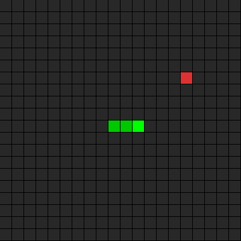

# lasm

A small functional language that compiles to JVM bytecode.

## Demo: Snake

A fully playable Snake game written in lasm, compiled to a standalone JAR with zero runtime dependencies.



```bash
clj -M -m lasm.cli compile examples/08_snake.lasm -o snake.jar
java -jar snake.jar
```

**Controls:** Arrow keys = move, SPACE = pause, R = restart

## Features

- **JVM Bytecode Compilation** - Compiles directly to bytecode using ASM
- **Java Interop** - Call any Java library, create objects, invoke methods
- **Strong Typing** - Static type checking with type annotations
- **Proxy Classes** - Implement Java interfaces with closure capture
- **Standalone JARs** - Compile to runnable JAR files (no runtime dependencies)

## Quick Examples

### Hello World
```lasm
printstr("Hello World!")
```

### Functions
```lasm
fn factorial(n: int): int =>
  if n <= 1
    1
  else
    n * factorial(n - 1)

printint(factorial(5))
```

### Java Swing GUI
```lasm
frame:javax.swing.JFrame = new javax.swing.JFrame("Hello Lasm")
label:javax.swing.JLabel = new javax.swing.JLabel("Hello World!")
container:java.awt.Container = frame.getContentPane()
container.add(label)
frame.pack()
frame.setVisible(true)
```

### Event Handling with Proxies
```lasm
listener:java.awt.event.ActionListener = proxy java.awt.event.ActionListener {
  actionPerformed(e:java.awt.event.ActionEvent): void => {
    label.setText("Clicked!")
  }
}
```

## Examples

See [`examples/`](examples/) for the full progression from hello-window to games:

| # | File | Description |
|---|------|-------------|
| 01 | `01_simple_window.lasm` | Empty JFrame window |
| 02 | `02_window_with_label.lasm` | Window with JLabel |
| 03 | `03_pong.lasm` | Static Pong layout with functions |
| 04 | `04_animated_pong.lasm` | Timer-based animation with ActionListener proxy |
| 05 | `05_keyboard_test.lasm` | KeyListener with 3-method proxy |
| 06 | `06_pong_full_game.lasm` | Playable Pong: keyboard input, ball physics, collision detection, scoring |
| 07 | `07_game_of_life.lasm` | Conway's Game of Life: recursive iteration, text rendering, double buffering |
| 08 | `08_snake.lasm` | Snake game: circular buffer, collision detection, BufferedImage rendering |

## Tutorials

- [Getting Started](docs/tutorial-hello-world.md) -- variables, functions, conditionals, Java interop, basic GUI
- [Building Pong](docs/tutorial-pong.md) -- mutable state via arrays, null layout, keyboard input, game loop
- [Building Game of Life](docs/tutorial-game-of-life.md) -- recursive grid traversal, text rendering, double buffering

## Usage

### Compile to JAR
```bash
clj -M -m lasm.cli compile examples/08_snake.lasm -o snake.jar
java -jar snake.jar
```

### Run directly (no JAR)
```bash
clj -M -m lasm.cli run examples/04_animated_pong.lasm
```

### Parse / inspect AST
```bash
clj -M -m lasm.cli parse examples/01_simple_window.lasm
clj -M -m lasm.cli ast examples/01_simple_window.lasm
```

## Language Syntax

### Variables
```lasm
x:int = 42
name:string = "Alice"
flag:bool = true
```

### Functions
```lasm
fn add(x: int, y: int): int => x + y

fn greet(name: string): string => {
  "Hello, ".concat(name)
}
```

### Conditionals
```lasm
fn max(a: int, b: int): int =>
  if a > b
    a
  else
    b
```

Block syntax in if/else:
```lasm
if code == 87 {
  x = x + 1
  setArrayElement(arr, 0, x)
} else {
  x = x - 1
  setArrayElement(arr, 0, x)
}
```

### Java Interop

**Create objects:**
```lasm
frame:javax.swing.JFrame = new javax.swing.JFrame("Title")
```

**Instance methods:**
```lasm
result:string = text.toUpperCase()
```

**Static methods:**
```lasm
absValue:int = java.lang.Math/abs(42)
```

**Static fields and null:**
```lasm
intType:java.lang.Class = java.lang.Integer/TYPE
panel.setLayout(java.lang.Object/null)
```

### Proxy Classes
Implement Java interfaces with closure capture:
```lasm
keyListener:java.awt.event.KeyListener = proxy java.awt.event.KeyListener {
  keyPressed(e:java.awt.event.KeyEvent): void => { printstr("pressed") }
  keyReleased(e:java.awt.event.KeyEvent): void => { printstr("released") }
  keyTyped(e:java.awt.event.KeyEvent): void => { printstr("typed") }
}
```

## How It Works

1. **Parse** - Source code is parsed into a parse tree using Instaparse
2. **AST** - Parse tree is transformed into an Abstract Syntax Tree
3. **Type Check** - Types are checked via bidirectional type checking
4. **IR** - AST is lowered to a stack-based intermediate representation
5. **Emit** - IR is compiled to JVM bytecode using the ASM library
6. **Load/Package** - Bytecode is loaded for execution or packaged into a JAR

## Project Structure

```
lasm/
├── src/lasm/
│   ├── parser.clj       # Instaparse grammar and AST transformation
│   ├── ast.clj          # AST-to-IR conversion, type environment
│   ├── type_checker.clj # Bidirectional type checking
│   ├── emit.clj         # JVM bytecode emission via ASM
│   ├── jar.clj          # Standalone JAR compilation
│   ├── cli.clj          # CLI interface (run, compile, parse, ast)
│   └── decompiler.clj   # Debug: bytecode disassembly
├── test/lasm/           # Test suite
├── examples/            # Example programs (01-08)
└── bin/lasmc            # Shell wrapper for compiler
```

## Development

### Running Tests
```bash
clj -M:test
```

### REPL Usage
```clojure
(require '[lasm.parser :as parser]
         '[lasm.ast :as ast]
         '[lasm.emit :as emitter])

(-> "fn add(x: int, y: int): int => x + y
     printint(add(5, 3))"
    parser/parser
    parser/parse-tree-to-ast
    ast/build-program
    emitter/emit-and-run!)
```

## Technical Details

### Type System
- Primitives: `int`, `bool`, `string`, `void`
- Java classes: Full Java type system via fully qualified names
- Null: `java.lang.Object/null` conforms to any reference type
- Type annotations required on variable declarations
- Variable reassignment infers type from prior declaration

### Compilation Strategy
- Functions compile to static methods on individual Java classes
- Proxy classes implement interfaces with captured variable fields
- Entry point class gets `main(String[])` for JAR execution
- ASM is compile-time only - no runtime dependencies in JARs

## License

See [LICENSE](LICENSE) file.
